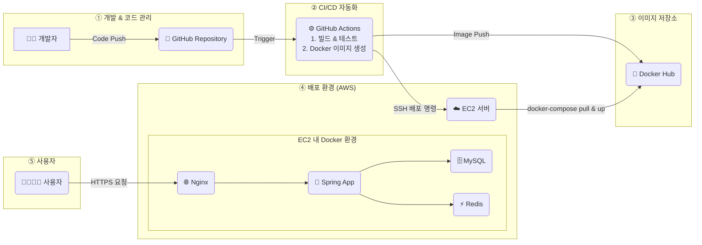

# 💬 실시간 채팅 애플리케이션 Chattrd
## 📖 프로젝트 소개

**Chattr**는 사용자들이 실시간으로 소통할 수 있는 웹 기반 채팅 애플리케이션입니다. <br>
**WebSocket** 을 활용한 실시간 메시지 전송, **Spring Security** 와 **JWT** 를 통한 안전한 인증/인가,<br>
그리고 **OAuth 2.0** 을 이용한 소셜 로그인 기능을 구현하여 사용자의 편의성과 보안을 모두 고려했습니다.

이 프로젝트의 핵심 목표는 단순히 채팅 기능을 구현하는 것을 넘어, 다음과 같은 기술적 경험을 쌓는 것이었습니다.

- `WebSocket`과 `STOMP`를 활용하여 실시간 양방향 통신 아키텍처를 직접 설계하고 구현하고자 했습니다.

- `Spring Security`, `JWT`, `OAuth 2.0`을 적용하여 보안과 사용자 인증/인가 프로세스에 대한 깊은 이해를 얻고자 했습니다

- **`소셜 회원`** 과 **`일반 회원`** 의 통합 관리를 설계하고 처리하는 방법을 경험했습니다.

- `Redis`를 활용한 캐싱 전략(@Cacheable)과 데이터 관리(Refresh Token, 이메일 인증 코드)를 통해 애플리케이션의 성능을 개선하고 DB 부하를 줄이고 응답 속도를 개선하는 경험을 했습니다.

- 관심사 분리 원칙에 따라 **계층형 아키텍처(Controller, Service, Repository)** 를 적용하고, 확장성과 유지보수성을 고려한 프로젝트 구조를 고민했습니다.


## ✨ 주요 기능
- 실시간 채팅: WebSocket을 통해 여러 사용자가 한 채팅방에서 실시간으로 메시지를 주고받을 수 있습니다. (StompController.java, WebSocketConfig.java)

- 사용자 인증:

    - 일반 로그인: Spring Security와 JWT를 사용하여 안전한 이메일/비밀번호 기반 로그인을 제공합니다. (AuthService.java, JwtTokenProvider.java)

    - 소셜 로그인: OAuth 2.0을 통해 Google, Kakao 계정으로 간편하게 로그인할 수 있습니다. (CustomOAuth2UserService.java)

- 채팅방 관리:

    - 채팅방 생성, 참여, 나가기 등 기본적인 채팅방 라이프사이클을 관리합니다. (ChatCommandService.java)
    - 방장(MASTER), 매니저(MANAGER), 멤버(MEMBER) 역할을 부여하고, 방장은 다른 유저의 역할을 변경하거나 유저를 추방할 수 있습니다. (ChatAdminService.java)

- 메시지 기능:

    - 메시지 '좋아요' 기능을 통해 사용자의 상호작용을 유도합니다. (MessageCommandService.java)

    - 채팅방 입장/퇴장/추방 시 시스템 알림 메시지를 전송합니다. (SystemMessageEventListener.java)

- 보안 및 검증:

    - 회원가입 시 이메일 인증을 통해 유효한 사용자인지 확인합니다. (EmailService.java)

    - 요청 데이터에 대한 유효성 검사를 통해 API 안정성을 확보합니다. (UserRequestDTO.java, ChatRequestDTO.java)

## 🛠️ 기술 스택


| 구분       | 기술                                                                                     |
|------------|------------------------------------------------------------------------------------------|
| Backend    | Java 17, Spring Boot 3.4.5, Spring Security, Spring Data JPA, WebSocket, Lombok         |
| Database   | MySQL 8.0                                                                               |
| Cache      | Redis (사용자 정보, 채팅방 멤버 캐싱 및 이메일 인증 코드 저장)<br>*(RedisService.java, RedisConfig.java)* |
| CI/CD      | GitHub Actions, Docker, Docker Compose, AWS EC2                                        |
| Build Tool | Gradle                                                                                  |
| API Docs   | SpringDoc OpenAPI *(OpenApiConfig.java)*                                                |

※ build.gradle 및 application.yml 파일에서 상세 의존성을 확인하실 수 있습니다.

## 🏛️ 아키텍처 및 설계

### 전체 시스템 아키텍처



### CI/CD 파이프라인
`GitHub Actions` 를 사용하여 `main` 브랜치에 코드가 푸시될 때마다 자동으로 빌드, 테스트, 도커 이미지 생성 및 AWS EC2 서버에 배포하는 CI/CD 파이프라인을 구축했습니다. (deploy.yml)


1. Push to `main`: 개발자가 main 브랜치로 코드를 푸시합니다.

2. GitHub Actions Trigger: 워크플로우가 자동으로 실행됩니다.

3. Build & Test: `./gradlew build` 명령어로 애플리케이션을 빌드하고 테스트를 수행합니다.

4. Docker Build & Push: `Dockerfile`을 사용하여 애플리케이션을 도커 이미지로 빌드하고, Docker Hub에 푸시합니다.

5. Deploy to EC2: `ssh-action`을 사용하여 EC2 서버에 접속한 후, docker-compose를 통해 최신 이미지를 받아 애플리케이션을 실행합니다.


## 2. DB 설계
### DB 전체 구조


### 회원


### 메시지


### 채팅방


## 3. API 목록

※ 자세한 API 명세는 /swaager-ui/index.html 을 통해 확인하실 수 있습니다.

### 사용자 및 인증 API (UserController , AuthController , EmailController)
| HTTP Method | URI                          | 설명                          |
|-------------|------------------------------|-------------------------------|
| POST        | /api/users                   | 신규 회원 가입                |
| DELETE      | /api/users                   | 회원 탈퇴                    |
| GET         | /api/users/me                | 내 정보 조회                 |
| POST        | /api/auth/login              | 이메일/비밀번호 로그인       |
| POST        | /api/auth/logout             | 로그아웃                    |
| POST        | /api/auth/refresh            | Access Token 재발급          |
| GET         | /api/auth/authentication     | 현재 인증 상태 확인          |
| POST        | /api/email/send              | 회원가입 이메일 인증코드 발송|
| POST        | /api/email/verify            | 이메일 인증코드 확인         |

### 채팅방 API (RoomController)
| HTTP Method | URI                        | 설명                              |
|-------------|----------------------------|-----------------------------------|
| POST        | /api/chats                 | 신규 채팅방 생성                 |
| GET         | /api/chats/list            | 전체 채팅방 목록 조회 (페이징)   |
| GET         | /api/chats/hot             | 인기 채팅방 목록 조회 (페이징)   |
| GET         | /api/chats/me              | 내가 참여중인 채팅방 목록 조회 (페이징) |
| GET         | /api/chats/my              | 내가 생성한 채팅방 목록 조회     |
| GET         | /api/chats/allList         | 모든 종류의 채팅방 목록을 한번에 조회 |


### 채팅 참여 API (ChatUserController)
| HTTP Method | URI                          | 설명                  |
|-------------|------------------------------|-----------------------|
| POST        | /api/chats/{chatId}/join     | 채팅방 참여           |
| POST        | /api/chats/{chatId}/exit     | 채팅방 나가기         |
| GET         | /api/chats/{chatId}/members  | 채팅방 멤버 목록 조회 |


### 채팅 메시지 API (MessageController)
| HTTP Method | URI                          | 설명                       |
|-------------|------------------------------|----------------------------|
| GET         | /api/chats/{chatId}/message  | 채팅방의 메시지 목록 조회  |
| POST        | /api/chats/{chatId}/msg/{msgId}/likes | 메시지 '좋아요' 토글   |


### 채팅 관리 API (ChatAdminController)
| HTTP Method | URI                                    | 설명               |
|-------------|----------------------------------------|--------------------|
| POST        | /api/chats/{chatId}/users/{targetId}/kick | 채팅방 멤버 추방  |
| POST        | /api/chats/{chatId}/users/{targetId}/role | 채팅방 멤버 역할 변경 |


---

## 🚀 도커 환경에서 시작하기

1. 프로젝트 클론

```bash
  git clone https://github.com/murphscall/be-chattr.git
  cd be-chattr
```

2. 환경변수 파일 생성

- yaml 에서 필요로 하는 환경변수 파일을 만들고 환경변수를 정의합니다.
- 도커 환경의 경우 mysql 과 redis 경로를 서비스 이름으로 설정합니다.

```bash
  # .env
  DB_PASS=your_mysql_password
  # ... 기타 JWT, OAuth 관련 환경 변수들
```

3. Docker Compose 실행

```bash
  docker-coompose up --build
```

## 🚀 로컬 환경에서 시작하기

1. 프로젝트 클론

```bash
  git clone https://github.com/murphscall/be-chattr.git
  cd be-chattr
```

2. 환경 변수 설정
- redis 와 mysql 주소를 localhost 로 환경변수 설정합니다.
```env
  DB_URL = ...//localhost:3306/...
  REDIS_HOST=localhost
```
<br>

## 🤔 프로젝트를 통해 배운 점 및 트러블 슈팅
### 1. 일반 로그인과 소셜 로그인 통합 관리

**문제:**
- Petory 프로젝트에서는 일반 회원과 소셜 회원의 테이블이 분리되어 있어 관리가 비효율적이었습니다.
   
**해결:** 
- User 테이블은 공통 정보를 가지게 하고, UserLogin 테이블을 추가하여 로그인 방식(NORMAL, KAKAO, GOOGLE)과 고유 ID를 저장하는 방식으로 구조를 개선했습니다. 이를 통해 어떤 방식으로 로그인하든 동일한 User 엔티티로 관리할 수 있게 되어 코드의 중복을 줄이고 확장성을 높였습니다. (User.java, UserLogin.java, CustomOAuth2UserService.java)

---
### 2. Redis를 활용한 성능 개선

**문제:** 
- 사용자 정보 조회나 채팅방 멤버 목록 조회 같이 반복적으로 호출되지만 데이터 변경이 잦지 않은 API에서 불필요한 DB 조회가 발생했습니다.

**해결:**
- @Cacheable 어노테이션을 사용하여 DB 조회 결과를 Redis에 캐싱했습니다. (UserService.java, ChatQueryService.java) 또한, 이메일 인증 번호나 Refresh Token 같이 만료 시간이 필요한 데이터를 Redis에 저장하여 효율적으로 관리했습니다. (EmailService.java, TokenService.java)

---

### 3. 느린 이메일 전송 시간

**문제**

- 기존에 동기적으로 구현되어진 이메일 전송 로직의 응답시간이 3~4000ms 으로 너무 오래 걸렸습니다.

**해결**

- 기존에 이메일 로직은 레디스에 인증번호 임시 저장 + 이메일 전송 까지 합쳐진 상태였습니다.
  해당 기능을 따로 분리하고 외부 서비스인 이메일 전송 부분은 비동기적으로 처리하여  응답 시간을 개선 했습니다.

```bash
    // 개선 전
    [API 요청] POST /api/email/send | 회원=anonymousUser
    [API 요청 완료] 응답 = 200 응답 시간 = 3913ms

    // 개선 후
    [API 요청] POST /api/email/send | 회원=anonymousUser
    [API 요청 완료] 응답 = 200 응답 시간 = 2ms
```
---

### 4. 메시지 목록 반환 시 N+1 쿼리

**문제**

- 메시지 목록을 불러와서 응답 DTO 로 변환하는 과정에서  Message 엔티티에 있는 List<MessageLike> 의 size를 조회할 때 
  반복문 안에서 하나의 메시지마다 쿼리가 나가는 문제가 발생했습니다.

**해결**

- 메시지 목록을 불러오는 시점에서 JPA 는 지연로딩으로 Message 엔티티 안에 List<MessageLike> 를 바로 불러오지 않고
  실제로 접근 할 때 그 때 쿼리를 발생시킵니다.
  그런데 반복문을 돌며 message.getLikes().size() 로 매번 접근을 하니 반복문 횟수 만큼 쿼리가 나가는 문제가 발생했고 
  fetch join 을 통해 전부 불러와서 N+1 쿼리 문제를 해결했습니다.


---

## 😢 프로젝트에 대한 고민과 결론

## 1. 채팅방 멤버 수를 어떻게 보여줄까?
   
### 고민한 점 🤔
   채팅방 목록을 보여줄 때, 각 방에 몇 명이 있는지 표시해줘야 했습니다.
   지금은 목록을 불러올 때마다 실시간으로 COUNT 쿼리를 실행해서 참여자 수를 세고 있습니다. 
   이 방법이 데이터는 가장 정확하지만, "나중에 채팅방이 수백 개가 되고 사용자가 많아지면, 매번 이렇게 인원수를 세는 게 느려지지 않을까?" 하는 고민이 있었습니다.


### 생각해본 해결책 🤓 
그래서 Chat 테이블에 memberCount라는 숫자 칸을 하나 만들어서, 사람이 들어오거나 나갈 때마다 이 숫자만 더하고 빼주는 방법을 생각해봤습니다. 
이렇게 하면 목록을 보여줄 땐 계산할 필요 없이 이 숫자만 바로 보여주면 되니까 훨씬 빠를 거라고 기대했습니다.
물론, 이 방법은 여러 명이 정말 동시에 들어오고 나갈 때 숫자가 꼬일 수 있는 동시성 문제가 생길 수 있습니다. 
이걸 해결하려면 '락(Lock)'이라는 기술을 써야 하는데, 그러면 또 성능이 느려지거나 데드락 문제 생길 수 있는 새로운 고민거리가 생겼습니다.

### 그래서 내린 결론은.. 
결론적으로, 지금 단계에서는 실시간 COUNT가 아직 눈에 띄게 느리지 않아서, 데이터가 가장 정확하게 보장되는 현재 방식을 유지하기로 했습니다. 
하지만 나중에 서비스가 더 커지고 "채팅방 목록이 느리다"는 피드백이 온다면, 가장 먼저 이 memberCount 방식을 적용해서 개선해 볼 계획입니다.


## 2. 채팅방에 들어갔을 때, 메시지는 어떻게 보여줘야 할까?

### 고민한 점 🤔
지금은 채팅방에 들어가면, 제가 처음 참여한 시간 이후의 모든 메시지를 한 번에 다 불러와서 보여주고 있습니다. <br>
만약 몇 달 동안 대화가 쌓인 채팅방이라면, 들어갈 때마다 수천, 수만 개의 메시지를 불러오게 되니까 로딩도 엄청 느리고 데이터 낭비도 심할 거라는 생각이 들었습니다.

### 생각해본 해결책 🤓
먼저 카카오톡이나 다른 메신저 앱들은 어떻게 처리를 하는지 탐색했습니다.
카카오톡이나 다른 메신저 앱들은 , 처음에는 가장 최근 대화 내용 30개 정도만 딱 보여주고, 사용자가 스크롤을 위로 올려서 이전 대화를 볼 수 있는 방식이었고,
구현을 한다면 현재 보고 있는 화면에서 마지막 메시지를 추적하는 기술이 필요하다고 생각했습니다.
그리고 그걸 기반으로 사용자의 화면이 그 메시지를 넘어가게되면 새로운 메시지 목록을 반환하면 어떨까 생각해보았습니다.

### 그래서 내린 결론..
이 기능은 사용자 경험에 직접적인 영향을 주는 아주 중요한 개선점이라고 생각합니다. 
그래서 이 기능은 당장 구현에 도전해볼 생각입니다. 
이 작업을 통해 채팅방 입장 속도를 빠르게 하고, 불필요한 데이터 로딩을 줄여서 훨씬 더 쾌적한 서비스를 만들 계획입니다.